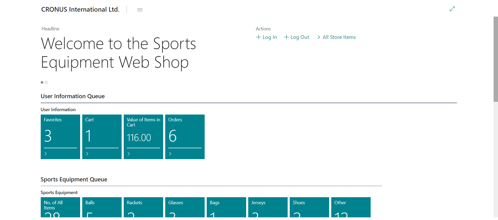
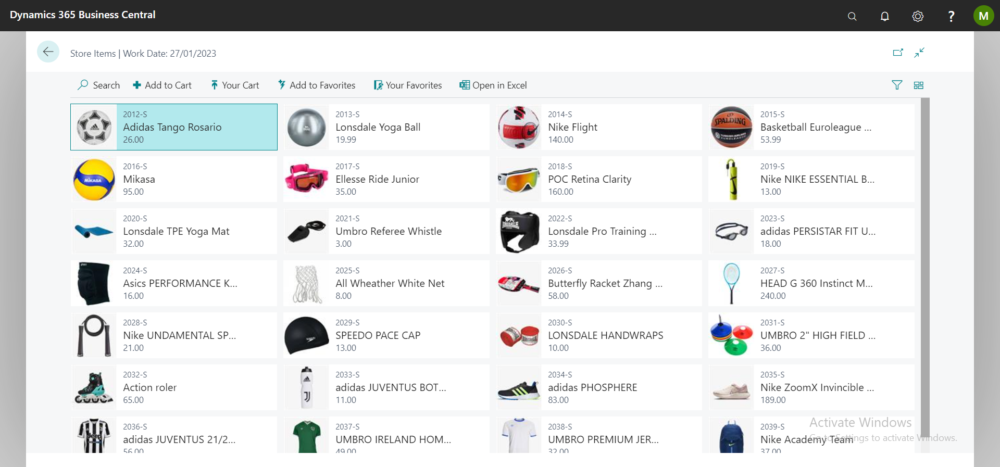
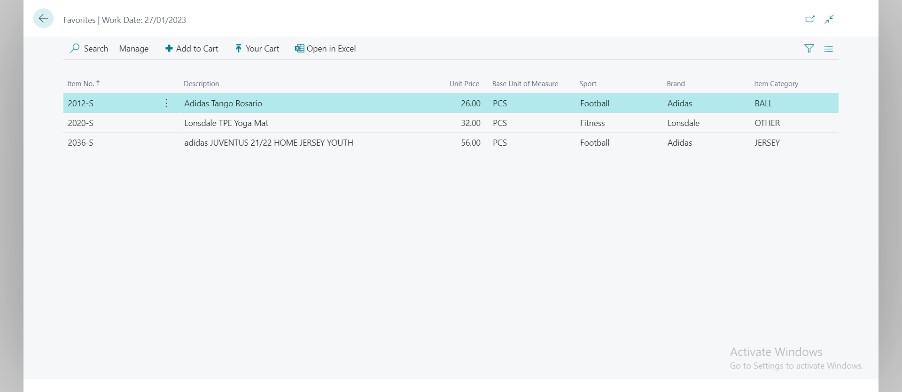

# Business Central Web Shop Integration

*Web Shop* for Sports Equipment made in Business Central. 

Both backend and frontend are done in BC, for practice purposes.

## Backend
https://bc-webshop.westeurope.cloudapp.azure.com

Endpoints:
- GET All Items (Intern is MM)
- GET Posted Sales Invoice
- GET All Gen. Journal Lines
- POST New Customer
- POST Sales Header
- POST Sales Order
- POST Sales Order
- POST Posted Sales Invoice
- POST Gen. Journal Line

## Frontend
http://bcv18-5-pr2021/BC

